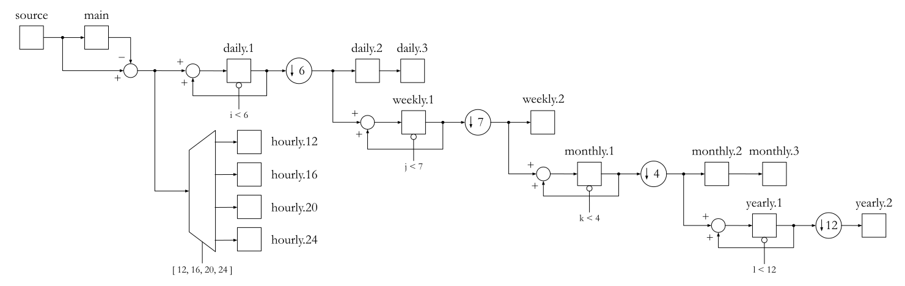
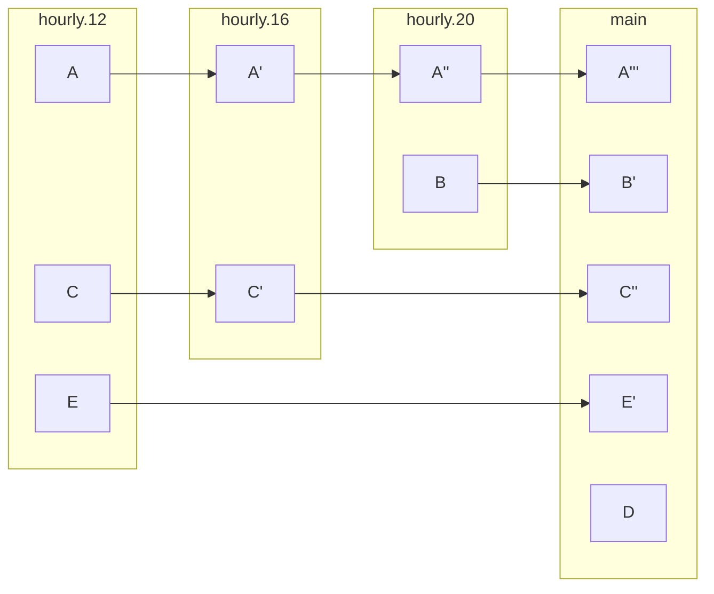

# 🧢 snapBack

This repository contains scripts to backup and restore my files. The backup script uses `rclone` to upload files to several remotes and create a reverse incremental backup. It can be modified to adapt to your needs changing the remotes and directories to be backup changing the `config.yaml` file.

1. [Usage](#usage)
2. [Philosophy](#philosophy)
   1. [Backup pipeline](#backup-pipeline)
   2. [Restoring](#restoring)
3. [Folder structure](#folder-structure)
4. [Explained example](#explained-example)
5. [Developer notes](#developer-notes)

## Usage

1. Install [rclone](https://rclone.org/) on your system.
2. Clone this repository.
3. Run `python backup.py` to backup your files. Otherwise, you can schedule the backup script to run periodically by running `python schedule.py`.
4. Run `python restore.py <remote> <directory> <snapback>` to restore your files, being:
   - `<remote>` the alias of your remote
   - `<directory>` the name of the directory to restore (e.g. `directory1`)
   - `<snapback>` the name of the backup to restore (e.g. `hourly.12`)

The available backups for each directory are: `hourly.12`, `hourly.16`, `hourly.20`, `hourly.24`, `daily.1`, `daily.2`, `daily.3`, `weekly.1`, `weekly.2`, `monthly.1`, `monthly.2`, `monthly.3`, `yearly.1` and `yearly.2`.

As the name suggests, the four hourly backups are created every 12, 16, 20 and 24 hours. The daily backups are created every 24 hours, the weekly backups every 7 days, the monthly backups every 4 weeks and the yearly backups every 12 months.

## Philosophy

### Backup pipeline

The backup script

- Reverse incremental backup

- Rolling Backup Strategy



To understand the backup pipeline, the following diagram is drawm. The diagram shows each folder as a square node. The arrows represent each one of the transfer of files. The data is transfered from one square node to the next one each time the backup script is executed, acting as a pipeline. The circles (and the trapezoid) represent the operations the files are subject to. There are four operations used:

- **Directory accumulation** (➕). It is defined as the operation of adding the files from the source directory to the destination directory, without overwriting existing files. This operation ensures that the destination directory contains the oldest version of each file:
    $$ AB + A'B = AB $$
    with $A$, $A'$ and $B$ as files where $A$ and $A'$ are two versions of a file such that $A < A'$, defining $<$ as "older than".

- **Directory differencing** (➖). It is defined as the operation of obtaining only the files that are different between the source and destination directories. This operation ensures that the destination directory only contains the newest version of each file:
    $$ A'B - AB = A' $$
    with $A$, $A'$ and $B$ as files where $A$ and $A'$ are two versions of a file such that $A < A'$, defining $<$ as "older than".

- **Downscaling** (⬇️). It is defined as a change in the updating frequency of the source directory to the destination, so that the destination is only updated once every $n$ times the backup script is executed.

- **Decoding** (represented by the trapezium). Selects one of multiple destination directories for the source directory, based on a given condition. Works as a switch in programming.

### Restoring

With this approach restoring files becomes easy. It is only necessary to accumulate the files from the desired directory back to the main directory.

## Folder structure

Each one of the source selected directories are synced with a directory in the root of the remote. The "snapbacks" are stored

```
📁 remote:/
├── 📁 .snapbacks/
|   ├── 📁 directory1/
|   |    ├── 📁 hourly.12/
|   |    ├── 📁 hourly.16/
|   |    ├── 📁 hourly.20/
|   |    ├── 📁 hourly.24/
|   |    ├── 📁 daily.1/
|   |    ├── 📁 daily.2/
|   |    ├── 📁 daily.3/
|   |    ├── 📁 weekly.1/
|   |    ├── 📁 weekly.2/
|   |    ├── 📁 monthly.1/
|   |    ├── 📁 monthly.2/
|   |    ├── 📁 monthly.3/
|   |    ├── 📁 yearly.1/
|   |    └── 📁 yearly.2/
|   └── 📁 directory2/   
|        └── 📁 ...       
├── 📁 directory1/
└── 📁 directory2/
```

## Explained example

This is the resulting backup folder structure:



## Developer notes

- [x] Separate config file from last backup information.
- [x] Class SnapBack should be config agnostic, without access to the config file, but rather receive the necessary information as arguments.
- [ ] Fix the following problem: imagine the program crashes. Would it know if the operation has been successful or no?
- [ ] Ensure scheduled tasks are running.