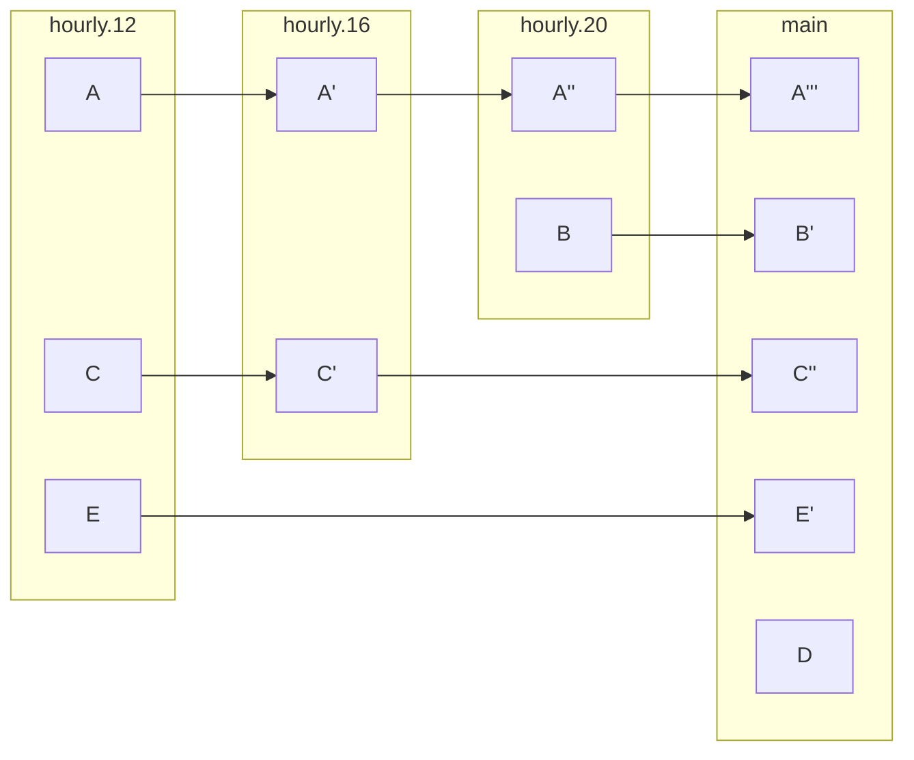

# Backup scripts

This repository contains scripts to backup and restore my files. The backup script uses `rclone` to upload files to several remotes (Raspberry Pi and OneDrive) and create a reverse incremental backup. It can be modified to adapt to your needs changing the remotes and directories to be backup changing the `config.yaml` file.

1. [Backup pipeline explanation](#backup-pipeline-explanation)
   1. [Philosophy](#philosophy)
   2. [Folder structure](#folder-structure)
   3. [Complete diagram](#complete-diagram)
2. [Setup](#setup)
3. [Developer notes](#developer-notes)

## Backup pipeline explanation

### Philosophy

The backup script

- Reverse incremental backup

- Rolling Backup Strategy

This is the resulting backup folder structure:



### Folder structure
```
📁 /                            
├── 📁 main/                    ├── 📁 daily.3/
|   ├── 📁 directory1/          |   └── 📁 ...
|   ├── 📁 directory2/          ├── 📁 weekly.1/
|   └── 📁 directory3/          |   └── 📁 ...
├── 📁 hourly.12/               ├── 📁 weekly.2/
|   ├── 📁 directory2/          |   └── 📁 ...
|   └── 📁 directory3/          ├── 📁 monthly.1/
├── 📁 hourly.16/               |   └── 📁 ...
|   └── 📁 ...                  ├── 📁 monthly.2/          
├── 📁 hourly.20/               |   └── 📁 ...
|   └── 📁 ...                  ├── 📁 yearly.1/ 
├── 📁 hourly.24/               |   └── 📁 ...
|   └── 📁 ...                  └── 📁 yearly.2/
├── 📁 daily.1/                     └── 📁 ...
|   └── 📁 ...
├── 📁 daily.2/
|   └── 📁 ...
```

### Complete diagram


## Setup

1. Install [rclone](https://rclone.org/) on your system.
2. Clone this repository.
3. Run `backup.py` to backup your files.
4. Run `restore.py` to restore your files.

## Developer notes

- [ ] Change datetime by iterators?